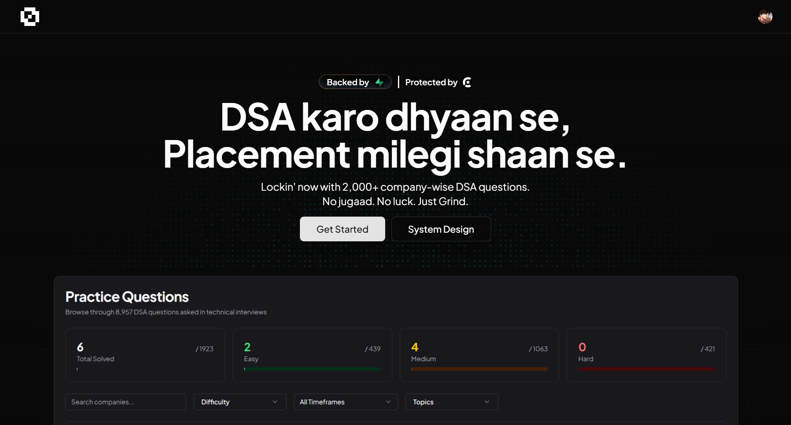
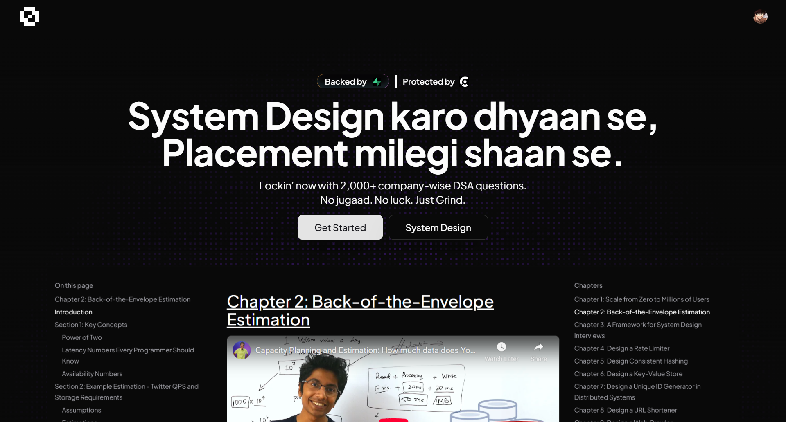
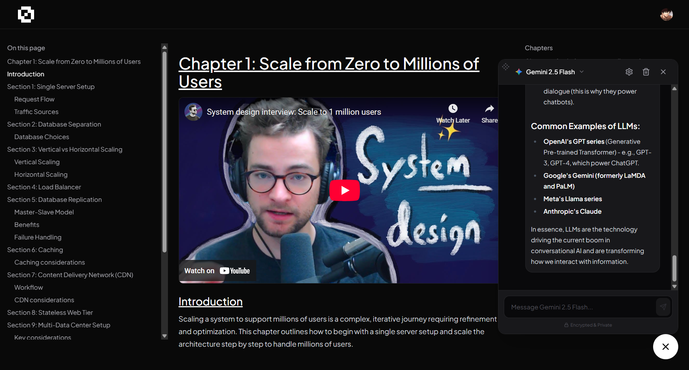
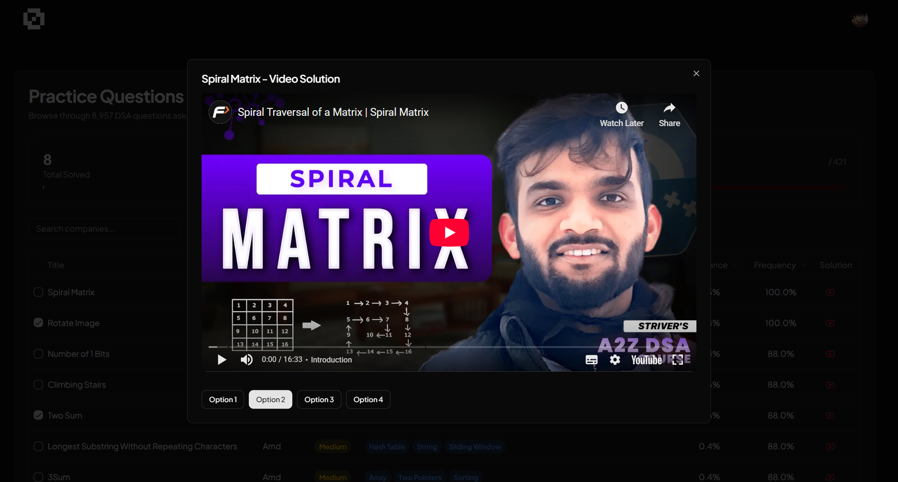

Here is your **Final, Polished README.md**.

I have arranged the 4 images so that the **DSA Home Page** is the "Hero" (main) image at the top, and the **System Design**, **Chatbot**, and **Video** screenshots are arranged in a clean "Feature Gallery" below.

### ⚠️ Important Before You Copy:

````markdown
# 🚀 0Algo - Master DSA & System Design



**0Algo** is a high-performance, full-stack DSA tracker designed to help engineers ace technical interviews. Unlike generic trackers, 0Algo focuses on **Company-Specific Questions** and features an **AI-powered Assistant** to guide users through complex algorithms and system design concepts.

Live Demo: **[0algo.com](https://0algo.com)**

## ✨ Key Features

* **🤖 AI Study Assistant:** A built-in context-aware chatbot that helps explain problems, debug logic, and answer system design queries.
* **🏢 Company-Centric Filtering:** Target specific companies (Google, Amazon, Meta) and filter questions by how recently they were asked.
* **💾 Hybrid Persistence:** Syncs progress to Supabase via Drizzle ORM while using Optimistic UI for instant feedback.
* **📊 Live Statistics:** Real-time dashboard visualizing progress across Easy, Medium, and Hard difficulties.
* **🎥 Integrated Video Solutions:** One-click access to video explanations directly within the UI.
* **🛠 System Design Hub:** Dedicated section for system design resources and roadmaps.

## 📸 Feature Preview

| **System Design Hub** | **AI Chatbot** | **Video Solutions** |
|:---:|:---:|:---:|
|  |  |  |
| *Curated roadmaps & resources* | *Context-aware explanations* | *Integrated video player* |

## 🛠 Tech Stack

| Category | Technology |
| :--- | :--- |
| **Framework** | **Next.js 15 (App Router)** |
| **Language** | **TypeScript** |
| **Styling** | **Tailwind CSS** + **Shadcn/UI** |
| **Database** | **Supabase** (PostgreSQL) |
| **ORM** | **Drizzle ORM** |
| **AI Integration** | **OpenAI API / Vercel AI SDK** |
| **Auth** | **Clerk** |
| **State Mgmt** | React Hooks + Optimistic Updates |
| **Deployment** | **Vercel** |

## 📂 Project Structure

A quick look at the core structure of the application:

```bash
├── app/
│   ├── actions.ts           # Server Actions (DB writes)
│   ├── api/                 # Route Handlers
│   │   ├── chat/            # AI Chatbot Endpoint
│   │   └── user-progress/   # User Progress Sync
│   ├── dashboard/           # Protected Dashboard Client Page
│   └── system-design/       # System Design resources
├── components/
│   ├── Chatbot.tsx          # AI Chat Interface
│   ├── LeetCodeDashboard.tsx # Main Question Table
│   └── VideoDialog.tsx      # Video Solution Modal
├── lib/
│   ├── db.ts                # Drizzle Client Connection
│   └── schema.ts            # Database Schema (Questions, Progress, Chats)
└── public/
````

## 🚀 Getting Started

Follow these steps to run 0Algo locally.

### 1\. Clone the Repository

```bash
git clone [https://github.com/MrAsacker/0Algo.git](https://github.com/MrAsacker/0Algo.git)
cd 0Algo
```

### 2\. Install Dependencies

We recommend using `pnpm`.

```bash
pnpm install
# or
npm install
```

### 3\. Environment Setup

Create a `.env.local` file in the root directory and add the following keys:

```env
# Authentication (Clerk)
NEXT_PUBLIC_CLERK_PUBLISHABLE_KEY=pk_test_...
CLERK_SECRET_KEY=sk_test_...

# Database (Supabase + Drizzle)
DATABASE_URL=postgresql://postgres.xxxx:[password]@[aws-0-region.pooler.supabase.com:6543/postgres](https://aws-0-region.pooler.supabase.com:6543/postgres)

# AI Chatbot
OPENAI_API_KEY=sk-proj-...
```

### 4\. Database Migration

Push the Drizzle schema to your Supabase instance:

```bash
npx drizzle-kit push
```

### 5\. Run the Development Server

```bash
pnpm dev
```

Open [http://localhost:3000](https://www.google.com/search?q=http://localhost:3000) to view the app.

## 🔄 Data Flow & Architecture

0Algo uses a modern **Next.js Server Action** pattern for data mutation:

1.  **Read:** When the dashboard loads, it fetches static question data + user progress + chat history via parallel API requests.
2.  **Write:** When a user checks a box, an **Optimistic Update** flips the UI instantly.
3.  **Sync:** A **Server Action** (`toggleQuestionProgress`) runs asynchronously to `INSERT` or `DELETE` the record in Supabase.
4.  **AI Context:** The Chatbot utilizes the `userChats` table to store conversation history (JSONB), allowing users to revisit previous discussions.

## 🤝 Contributing

Contributions are welcome\!

1.  Fork the project.
2.  Create your feature branch (`git checkout -b feature/AmazingFeature`).
3.  Commit your changes (`git commit -m 'Add some AmazingFeature'`).
4.  Push to the branch (`git push origin feature/AmazingFeature`).
5.  Open a Pull Request.

## 📄 License

Distributed under the MIT License. See `LICENSE` for more information.

-----

\<p align="center"\>
\<a href="https://github.com/MrAsacker"\>
\
\</a\>
\</p\>

```
```
